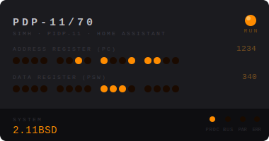

# PiDP-11 for Home Assistant

> *Lights that blink. Switches that matter. A 1975 computer that now lives in your smart home.*

Run the iconic [PiDP-11](https://obsolescence.wixsite.com/obsolescence/pidp-11) — Oscar Vermeulen's
beautiful reproduction of the PDP-11/70 front panel — on a Raspberry Pi 5 alongside
Home Assistant OS, and wire it up to your HA dashboard with live register displays,
CPU state sensors, and front-panel services.

Powered under the hood by [SimH](http://simh.trailing-edge.com/) via the
[obsolescence/pidp11](https://github.com/obsolescence/pidp11) distribution, with the
GPIO lamp driver running inside an HAOS Supervisor add-on container.

---

## Dashboard Card

Add the **PiDP-11 Front Panel** card to any Lovelace dashboard for a live view of the
running emulator — amber address and data LEDs, the run/halt lamp, and the currently
booted OS.



The card auto-registers when you install the integration — no manual Lovelace resource
step needed. Just add it:

```yaml
type: custom:pidp11-panel-card
```

Or click **Add Card → PiDP-11 Front Panel** in the Lovelace card picker.

### What the lights mean

| Row | Source | What it shows |
|-----|--------|---------------|
| **ADDRESS** (top) | `EXAMINE PC` | Program counter, displayed as 16 binary LEDs (MSB left). Groups of 4 = one hex nibble. |
| **DATA** (bottom) | `EXAMINE PSW` | Processor status word — interrupt level in bits 7–5, condition codes in bits 3–0. |
| **RUN lamp** | CPU state | Amber = CPU running; dark = halted; very dark = add-on offline. |
| **PROC dot** | CPU state | Mirrors the RUN lamp — on when the CPU is executing instructions. |

The card polls via the integration's `DataUpdateCoordinator` (default interval: 5 s).
It is **not** a live oscilloscope — real PDP-11 programs execute millions of instructions
per second and the lamps would be a blur. Think of it as a heartbeat display: you see
where the CPU is parked between polling ticks.

Full real-time lamp animation (matching the physical hat's 60 Hz LED update rate) is
the goal for S5 phase 2 and requires a dedicated push-notification channel from the
`pidp1170_blinkenlightd` GPIO driver. See [S5 sprint plan](./docs/sprints/S5-lamps-switches-dashboard.md).

### Optional entity overrides

The card defaults to the entity IDs the integration creates automatically. Override any
of them if you've renamed your device:

```yaml
type: custom:pidp11-panel-card
state_entity:  sensor.pidp11_cpu_state
pc_entity:     sensor.pidp11_pc
psw_entity:    sensor.pidp11_psw
system_entity: sensor.pidp11_system
```

---

## What ships from this repo

Two artifacts in one repo, because HA distributes Python and containers through
different channels:

| Artifact | Channel | What it does |
|----------|---------|--------------|
| **`pidp11-addon/`** | Supervisor add-on | Docker container running SimH + GPIO lamp/switch driver (`pidp1170_blinkenlightd`) + SSH console via `dropbear`. Needs `/dev/gpiomem*` on Pi 5 with the PiDP-11 hat. |
| **`custom_components/pidp11/`** | HACS Integration | Python integration exposing HA entities, services, and the Lovelace card. Talks to the add-on over the auth-shim TCP port (default 2223). |

The add-on includes a boot-select encoder: at startup it reads the front-panel SR
switches via `scansw` and boots the OS whose octal code matches the switch pattern
(e.g., SW0 up → `0001` → RSX-11M+). All-switches-down falls back to the `default_boot`
add-on option.

---

## Running without Home Assistant

Just want the blinking lights without HA? The same Docker image runs as a
standalone PDP-11 on any Raspberry Pi 5 with Docker installed — pull, run,
SSH in, enjoy.

```bash
docker run -d --name pidp11 --restart unless-stopped \
  --privileged --network host \
  -v /run/rpcbind.sock:/run/rpcbind.sock \
  -v /opt/pidp11-share:/share \
  -v pidp11-data:/data \
  -e ENABLE_GPIO=true \
  -e SSH_PASSWORD=pdp11 \
  -e SSH_PORT=2211 \
  ghcr.io/dmz006/pidp11-addon:latest
```

Full instructions, prerequisites, disk image staging, and OS boot table:
**[docs/standalone-docker.md](./docs/standalone-docker.md)**

Front panel controls, OS switch table, and shutdown procedures:
**[docs/front-panel.md](./docs/front-panel.md)**

---

## Supported topologies

### Topology A — Pi runs both the emulator and HAOS (add-on mode)

The Pi 5 runs **HAOS** directly (or HA Supervised). The PiDP-11 add-on installs inside
the Supervisor. The HACS integration talks to it on `127.0.0.1:2223`. This is the
simplest setup — everything on one board.

### Topology B — Pi runs the emulator; HAOS is on a separate machine

The Pi 5 runs **Docker standalone** with the PiDP-11 image. Your Home Assistant instance
is a VM, NUC, or another host on the same LAN. The HACS integration is installed on
that remote HA and connects to the Pi's IP on port 2223. mDNS/zeroconf auto-discovery
advertises the Pi on your LAN so HA finds it automatically.

Both topologies are fully supported. HAOS and HA Supervised both work in topology A.
HA Container and HA Core do not support add-ons and are only usable in topology B.

Hardware: **Raspberry Pi 5** with the PiDP-11 hat. The Pi 5 uses the RP1 I/O chip;
the GPIO driver has been tested and confirmed working (`/dev/gpiomem0`–`/dev/gpiomem4`).

---

## Quick install

### Topology A — Pi + HAOS (add-on mode)

1. Settings → Add-ons → Add-on Store → ⋮ → **Repositories** → paste `https://github.com/dmz006/pidp11-hacs`. Install **PiDP-11 Emulator**.
2. Add-on **Configuration** → set an `ssh_password` → **Start**.
3. Watch the add-on log: within ~30 s you should see `[pidp11] Starting SimH` and the
   physical lamps should begin blinking.
4. HACS → ⋮ → **Custom repositories** → add `https://github.com/dmz006/pidp11-hacs`, category *Integration*. Install **PiDP-11**.
5. Settings → Devices & Services → **Add Integration** → *PiDP-11*.
   - Host: `127.0.0.1` (add-on is reachable at localhost)
   - Port: `2223`
   - Shared secret: auto-detected from `/share/pidp11/remote_console.secret`
6. Open any Lovelace dashboard → **Edit** → **Add Card** → search *PiDP-11 Front Panel*.

### Topology B — Pi running Docker; HAOS on a separate host

1. On the Pi: follow **[docs/standalone-docker.md](./docs/standalone-docker.md)** to start
   the container. The add-on image advertises itself via mDNS and listens on port 2223.
2. On your HAOS VM / NUC:
   - HACS → ⋮ → **Custom repositories** → add `https://github.com/dmz006/pidp11-hacs`, category *Integration*. Install **PiDP-11**.
   - Restart HA.
3. HA should show **"New device found: PiDP-11"** within ~30 s (mDNS auto-discovery).
   Click **Configure**, enter the shared secret and you're done.

   **If the mDNS notification doesn't appear** (different subnets, or multicast blocked):
   Settings → Devices & Services → **Add Integration** → *PiDP-11* → enter the Pi's IP,
   port `2223`, and the shared secret manually.

   **To retrieve the secret from the Pi:**
   ```sh
   ssh pdp11@<pi-ip> -p 2211 'cat /data/remote_console.secret'
   # or read it from the container log on first boot
   ```

### SSH to the PDP-11 console

```sh
ssh pdp11@<ha-host> -p 2211
# password = whatever you set in step 2
```

You land in a `screen` session attached to SimH's interactive console. The PDP-11
is right there. Type `HALT`, then `EXAMINE PC`, then `CONTINUE` — watch the LEDs react.

---

## Entities & Services

### Sensors

| Entity | What it shows |
|--------|---------------|
| `sensor.pidp11_cpu_state` | `running` / `halted` / `offline` |
| `sensor.pidp11_pc` | Program counter (octal) |
| `sensor.pidp11_psw` | Processor status word (octal) |
| `sensor.pidp11_system` | Booted OS: `idled`, `211bsd`, `rsx11mp`, … |
| `sensor.pidp11_cpu_mode` | `kernel` / `supervisor` / `user` (from PSW bits 15–14) |
| `sensor.pidp11_sr` | Switch register (octal) with per-bit attributes `SR0`–`SR21` |

### Binary sensors

| Entity | What it shows |
|--------|---------------|
| `binary_sensor.pidp11_halted` | `on` when CPU is halted |
| `binary_sensor.pidp11_sr0` – `binary_sensor.pidp11_sr21` | Individual front-panel switch positions (22 sensors, updated via 250 ms push stream) |

### Services

| Service | Parameters | What it does |
|---------|------------|--------------|
| `pidp11.halt` | — | Halts the CPU (front-panel HALT) |
| `pidp11.continue_cpu` | — | Resumes from HALT |
| `pidp11.examine` | `address` | Returns the value at a SimH address/register |
| `pidp11.deposit` | `address`, `value` | Deposits a value (octal) at address |
| `pidp11.boot` | `target` | Boots a system by name |

Example automation — announce when the PDP-11 halts:
```yaml
trigger:
  - platform: state
    entity_id: sensor.pidp11_cpu_state
    to: halted
action:
  - service: notify.mobile_app
    data:
      message: "The PDP-11 just halted at PC {{ states('sensor.pidp11_pc') }} (octal)"
```

---

## Bootable systems

The add-on ships these systems in the image (no disk required):

| SR octal | OS | Notes |
|----------|----|-------|
| `0000` | *(default_boot option)* | All switches down → follow add-on config |
| `0001` | `idled` | Idle loop with lamp animation — the screensaver |
| `1002` | `blinky` | Pure LED demo, no OS |

These systems need disk images staged at `/share/pidp11/disks/<name>/`:

| SR octal | OS | Disk |
|----------|----|------|
| `0001` | `rsx11mp` | `PiDP11_DU0.dsk` |
| `0002` | `rsts7` | (pre-stage) |
| `0101` | `unix1` | `disk0.hp` |
| `0102` | `211bsd` | downloaded automatically on first boot (~250 MB) |

Full switch-to-OS mapping is in `pidp11-addon/systems/selections`.

---

## Card developer notes

> For contributors and future sprints — here is how the card is built and where to go next.

### Architecture

```
custom_components/pidp11/www/pidp11-panel-card.js  ← the card (vanilla JS)
custom_components/pidp11/__init__.py               ← serves the file + calls add_extra_js_url()
```

The card is **zero-dependency vanilla JS** (no npm, no webpack, no Lit import).
It extends `HTMLElement` directly, attaches a shadow root, and rebuilds `innerHTML`
on every `hass` set (every 5 s coordinator tick). At this update rate that is
completely fine — no diffing needed.

The integration's `async_setup_entry` calls `hass.http.register_static_path()` to
serve the file at `/pidp11-hacs/pidp11-panel-card.js`, then calls
`add_extra_js_url()` so HA loads it in every frontend session. The `customElements.define`
call in the JS makes `type: custom:pidp11-panel-card` work in Lovelace.

### What the card draws today (S5 phase 1)

- **ADDRESS row** — PC value as 16 binary LEDs (4 groups of 4)
- **DATA row** — PSW value as 16 binary LEDs
- **RUN lamp** — amber when `sensor.pidp11_cpu_state == "running"`
- **System name** — from `sensor.pidp11_system`
- **Status indicators** — PROC / BUS / PAR ERR / ADRS ERR (BUS/PAR/ERR always off — no source yet)

### S5 phase 2: real-time lamp animation

The physical PiDP-11 hat updates its lamps at ~60 Hz from `pidp1170_blinkenlightd`,
which receives lamp register values from SimH via ONC RPC. To mirror that in the
Lovelace card we need a push channel — either:

- **Option A**: A Unix socket inside the container that the HA integration subscribes
  to; blinkenlightd writes a compact JSON/binary frame each time it updates the lamps.
- **Option B**: An HTTP/SSE endpoint in the add-on that streams lamp state.
- **Option C**: Upstream PR to `obsolescence/pidp11` adding a push socket to the driver.

Once the channel exists, the card will subscribe via `hass.connection.subscribeEvents()`
or a WebSocket endpoint and repaint at up to 20 Hz (the Lovelace animation budget).
Binary sensors for each physical switch (`binary_sensor.pidp11_sw_halt`, etc.) will
also come from this channel. See [S5 sprint](./docs/sprints/S5-lamps-switches-dashboard.md).

### Adding the card to HACS as a Lovelace plugin

When the card matures enough to list separately, register the repo in HACS as a
**Plugin** category (in addition to the Integration category registration). Update
`hacs.json` to add `"plugin": true` or create a separate plugin entry. The card file
is already at the root-accessible path the HACS plugin installer expects.

---

## Upstream projects

This project stands on the shoulders of giants:

- **[PiDP-11](https://obsolescence.wixsite.com/obsolescence/pidp-11)** by
  [Oscar Vermeulen](https://github.com/oscarverein) — the hardware kit, PCB, GPIO driver,
  and curated OS disk images that make the whole thing possible. If you don't have one,
  you should get one. It's gorgeous.
- **[obsolescence/pidp11](https://github.com/obsolescence/pidp11)** — the software
  distribution: SimH with realcons patches, `pidp1170_blinkenlightd`, `scansw`, boot
  scripts, and disk images for a dozen vintage OSes.
- **[SimH](http://simh.trailing-edge.com/)** — the multi-system simulator that actually
  emulates the PDP-11/70 CPU, memory, and peripherals. Without SimH there is no PDP-11.
- **[SIMH on GitHub](https://github.com/simh/simh)** — the community-maintained SimH
  fork with active development.
- **[Home Assistant](https://www.home-assistant.io/)** — the open-source home
  automation platform doing the heavy lifting on the HA side.

---

## Status

Working end-to-end on Pi 5 + HAOS + PiDP-11 hat as of June 2026:

- ✅ Lamps blink (IDLED pattern, 2.11BSD boot animation, all confirmed)
- ✅ SR switch reading works (scansw, aarch64, Pi 5 RP1 GPIO)
- ✅ Boot-select encoder works (SW0 up → `0001` → RSX-11M+)
- ✅ HA sensors: cpu_state, PC, PSW, system, cpu_mode, switch register (SR)
- ✅ Binary sensors: CPU halted, SR0–SR21 (22 per-switch sensors)
- ✅ HALT/CONTINUE services work; HALT→RUNNING transition in < 3 s
- ✅ SSH console (port 2211)
- ✅ Lovelace front panel card (S5 phase 1 — register snapshot, not live lamps)
- ✅ SR watch stream: 250 ms push channel for switch change events (port 2225)
- ✅ mDNS auto-discovery: remote HAOS finds the Pi on the LAN automatically
- ⏳ v1.0.0 release tag + GHCR image build
- ⏳ S5 phase 2: real-time lamp animation (needs driver push channel)

See `docs/sprints/` for the full sprint plan.

---

## License

MIT. See `LICENSE`. The upstream `obsolescence/pidp11` distribution uses MIT-style
per-file headers; see `docs/risks.md` for the license-hygiene note.
