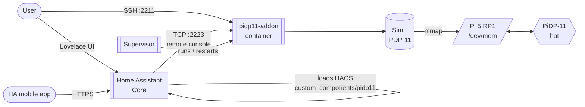
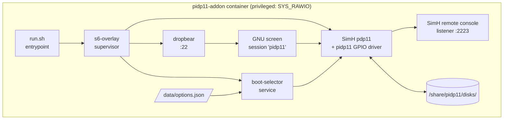
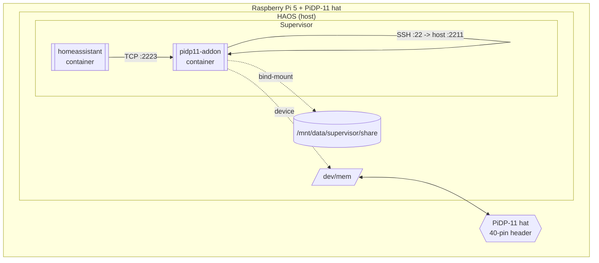
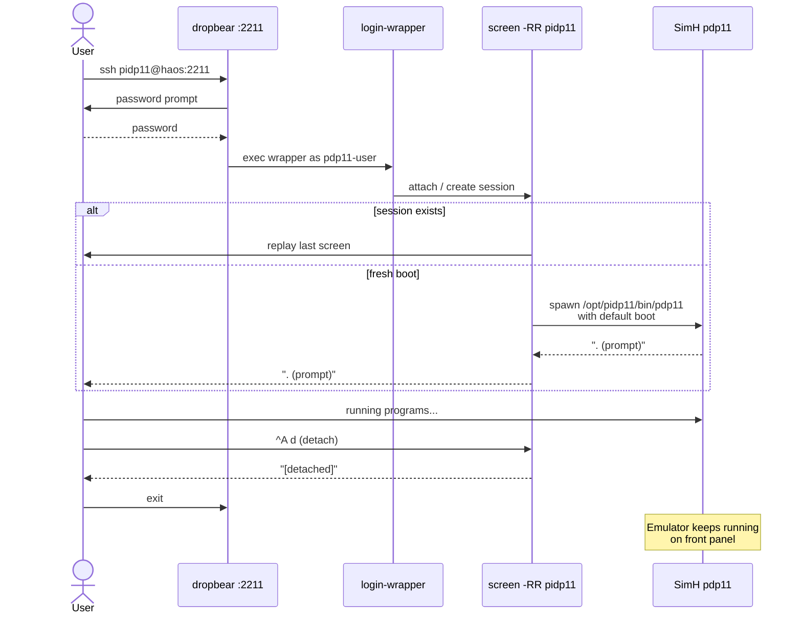
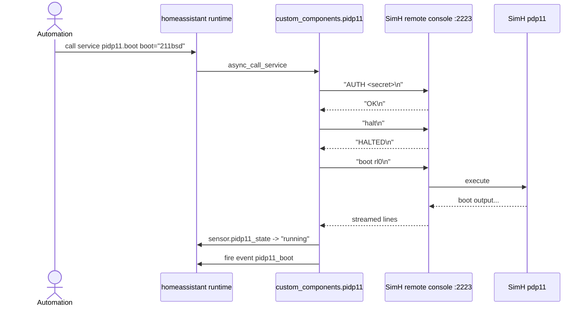
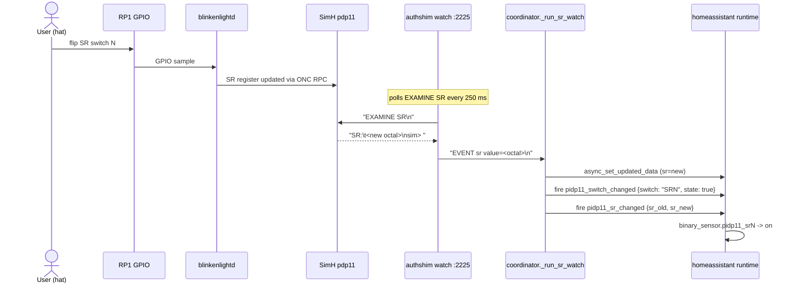
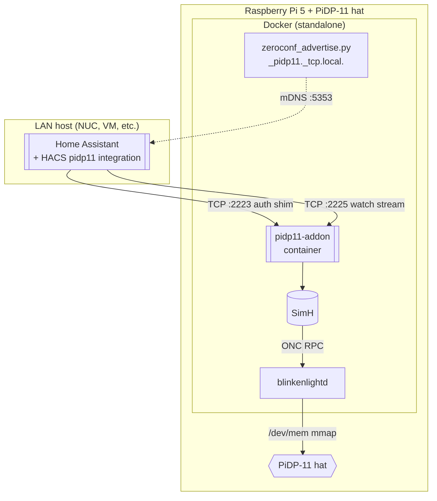
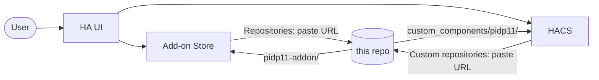

# Diagrams

All diagrams are Mermaid; GitHub, most IDEs, and `mdbook-mermaid` render
them inline.

---

## 1. System context

## 2. Component (inside the add-on container)

## 3. Deployment (single Pi 5 node)

## 4. Sequence — user SSH console

## 5. Sequence — HA service pidp11.boot

## 6. Sequence — SR switch change → HA binary sensor (watch stream)

## 7. Topology B — Remote Pi deployment

## 8. Install-time view

## 9. Install-time view

